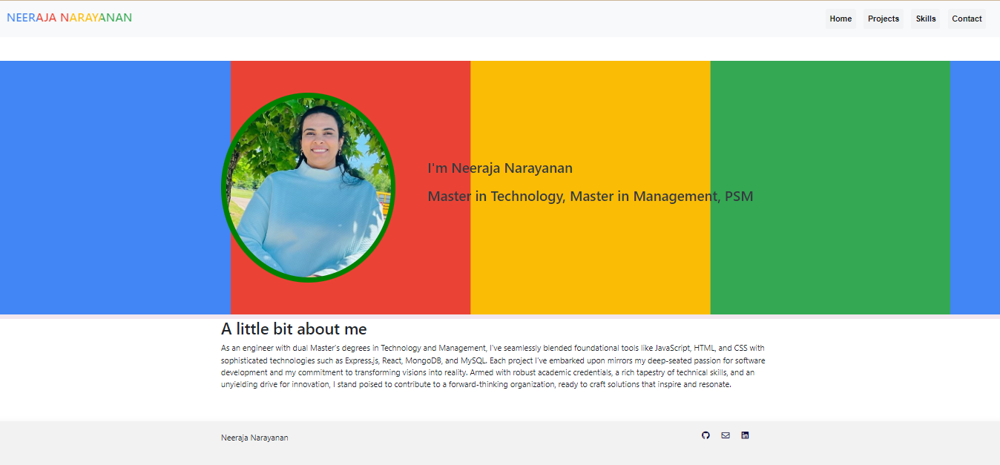
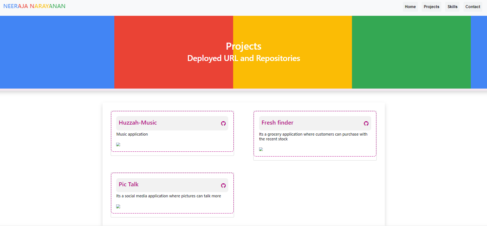
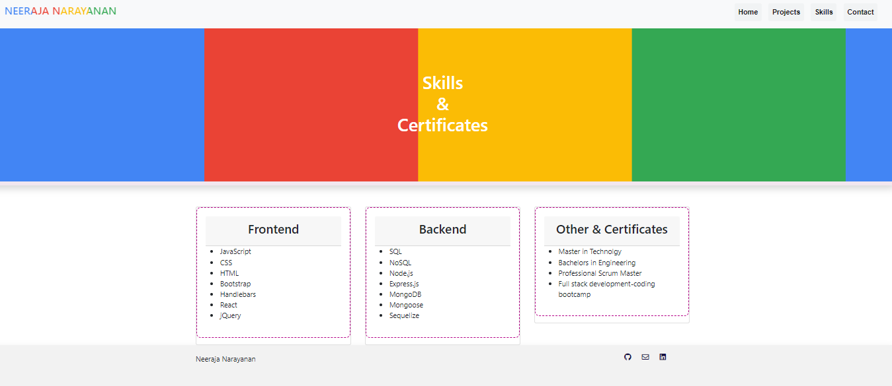
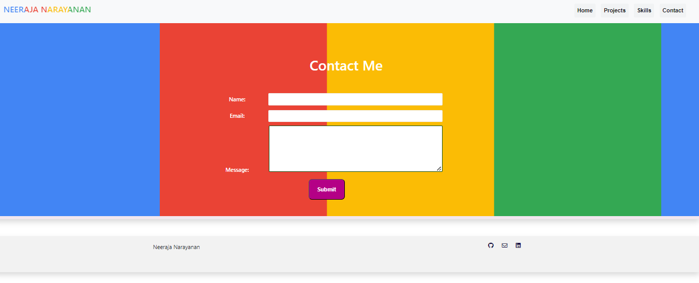

# Neerajas's React Portfolio ✨
Welcome to the source code of the most dynamic React portfolio ever crafted. Dive in to witness the fusion of creativity and functionality!

# 🚀 Quick Overview
This project encapsulates my journey as a React developer. The portfolio showcases my projects, skills, and everything I've learned and achieved. Designed with ❤️ and a touch of ✨.

# 🎨 Features
Dynamic Projects Section: Watch projects pop with interactive modals!
Responsive Design: Made for desktops, tablets, and mobiles.
Dark Mode: Because who doesn't love a good dark theme?
Smooth Animations: Every scroll, every click, you're in for a visual treat.
Contact Form: Integrated with [service-name] to shoot emails directly!

# 🛠️ Technologies Used
React: Frontend magic!
Styled Components: For sleek, styled components.
React Router: For awesome navigation.

# 🚴‍♂️ Quick Start
Interested in running my portfolio locally? Follow these steps:

Clone the repository:
bash
Copy code
git clone [your-repository-link]
Move to the directory:
bash
Copy code
cd [repository-name]
Install dependencies:
bash
Copy code
npm install
Run the app:
bash
Copy code
npm start
Visit http://localhost:3000 in your browser 

# 📃 License & Acknowledgements
This project is licensed under the MIT License - see the LICENSE.md file for details.

https://github.com/hineeraja/React--Portfolio

